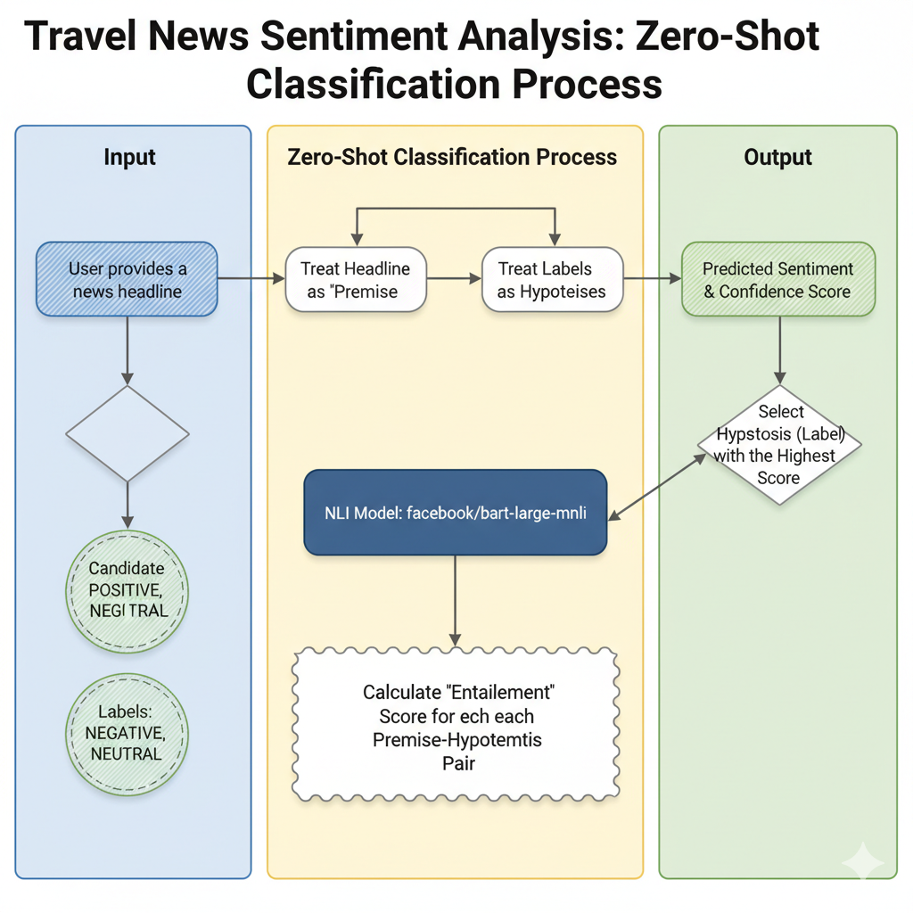

# Travel News Sentiment API


This project provides a simple REST API built with FastAPI to analyze the sentiment of travel-related news text. It classifies a given piece of text as **POSITIVE**, **NEGATIVE**, or **NEUTRAL** using a powerful zero-shot classification model from Hugging Face.

## Technology Stack

<p>
  
  
  
  
</p>

## About the Model: `facebook/bart-large-mnli`

This API uses the `facebook/bart-large-mnli` model, which is a large version of the **BART** (Bidirectional and Auto-Regressive Transformer) model.

* **BART Architecture**: BART is a denoising autoencoder for pretraining sequence-to-sequence models. It's trained by corrupting text with an arbitrary noising function and then learning a model to reconstruct the original text. This pre-training method makes it particularly effective for a wide range of natural language understanding and generation tasks.
* **Fine-tuning on MNLI**: This specific version of BART was fine-tuned on the **Multi-Genre Natural Language Inference (MNLI)** dataset. The NLI task involves taking a pair of sentences (a "premise" and a "hypothesis") and determining if the hypothesis is an *entailment* (follows from), *contradiction*, or *neutral* with respect to the premise.
* **Zero-Shot Classification**: We leverage the model's NLI capabilities for **zero-shot classification**. Instead of training a new model specifically on travel news sentiment, we frame our problem as an NLI task.

  * The input news text becomes the **premise**.
  * Our candidate labels (`POSITIVE`, `NEGATIVE`, `NEUTRAL`) become the **hypotheses**.

  The model then calculates the probability that the premise entails each hypothesis. The label with the highest probability is returned as the predicted sentiment. This powerful technique allows the model to classify text into categories it has never seen during its training.

### How It Works: A Visual Flow



## How This API Helps Travellers

Imagine you're planning a trip to a new country. Beyond looking at travel guides, you want to get a real-time sense of the current atmosphere or "vibe" of your destination. This API can help you do just that.

By feeding it recent news headlines from the city or country you plan to visit, you can get an aggregated view of the local sentiment:

* **Overwhelmingly POSITIVE news?** This could indicate a period of celebration, economic prosperity, or general safety, suggesting a vibrant and welcoming environment for your trip.
* **A spike in NEGATIVE news?** This might alert you to political unrest, social issues, or natural disasters, allowing you to be more cautious or even reconsider your travel plans.
* **Mostly NEUTRAL news?** This suggests a "business as usual" state of affairs.

In essence, this tool allows a traveller to go beyond static reviews and get a dynamic, data-driven insight into their destination, helping them make safer and more informed decisions.

## Getting Started

### Prerequisites

* Python 3.8+
* `pip` package installer

### Installation

1. **Clone the repository:**

   ```bash
   git clone <your-repo-url>
   cd sentimentanalysis
   ```
2. **Create and activate a virtual environment (recommended):**

   ```bash
   python -m venv venv
   source venv/bin/activate  # On Windows, use `venv\Scripts\activate`
   ```
3. **Install the required dependencies:**
   You will need to create a `requirements.txt` file with the following content:

   ```
   fastapi
   uvicorn[standard]
   pydantic
   transformers
   torch
   ```

   Then, install them:

   ```bash
   pip install -r requirements.txt
   ```

   *(Note: The first time you run the app, the `transformers` library will download the `facebook/bart-large-mnli` model, which is over 1GB in size.)*

### Running the Application

Run the application using Uvicorn:

```bash
uvicorn main:app --reload
```

The API will be available at `http://127.0.0.1:8000`.

## API Endpoints

### 1. Analyze Sentiment

Analyzes the sentiment of the provided text.

* **Endpoint:** `POST /analyze_travel_news`
* **Request Body:**
  ```json
  {
    "text": "A new high-speed train route has been launched, cutting travel time between major cities by half."
  }
  ```
* **Success Response (200 OK):**
  The response includes the original text, the predicted label, and the confidence score for that label.
  ```json
  {
    "news_text": "A new high-speed train route has been launched, cutting travel time between major cities by half.",
    "label": "POSITIVE",
    "score": 0.9985185265541077
  }
  ```

### 2. Root

Returns a welcome message.

* **Endpoint:** `GET /`
* **Success Response (200 OK):**
  ```json
  {
    "message": "Welcome to the Travel News Sentiment API! Use /analyze_travel_news with POST."
  }
  ```
